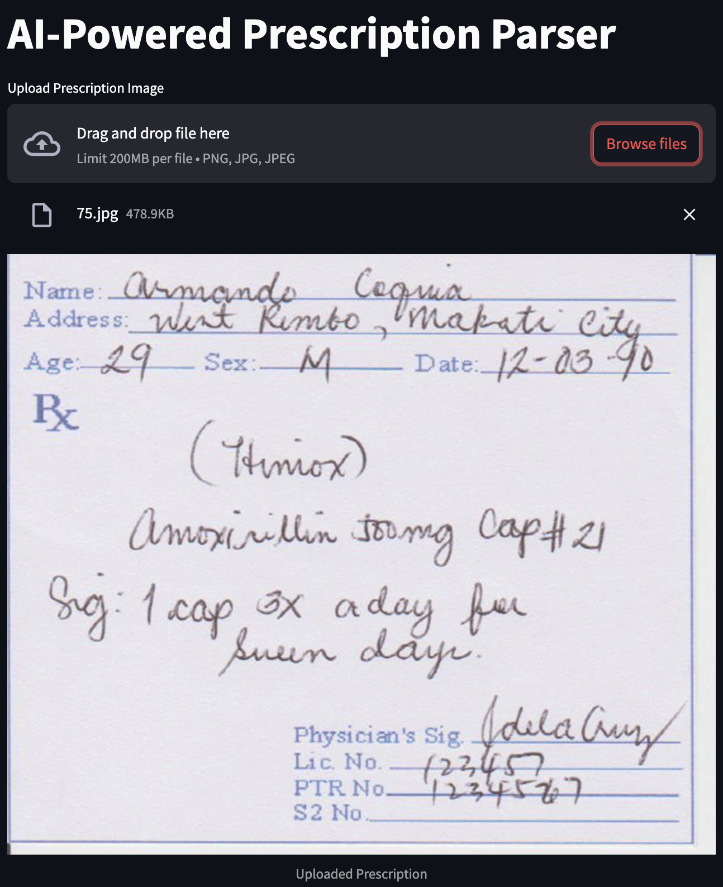

# Pharmacist's Assistant

This project automates the extraction of structured prescription details from handwritten and printed medical prescriptions. It leverages Google Gemini AI to analyze prescription images and extract essential details, presenting them in a structured JSON format.


## Requirements

- Python 3.7+
- Google GenAI
- Pillow
- python-dotenv
- Streamlit

To install dependencies, run:

```
pip install -r requirements.txt
```

## Installation

1. Clone the repository:

```
git clone https://github.com/SreenityaThatikunta/Medical-Assistant.git
cd Medical-Assistant
```

2. Set up your Gemini API key in .env

```
key = 'YOUR_KEY_HERE'
```

## Usage

1. Run the script:

```
streamlit run PharmaAssist.py
```

2. Upload a prescription image (PNG, JPG, or JPEG) using the file uploader in the Streamlit interface.

3. The app will display the uploaded image and extract the prescription details, presenting them in a structured JSON format.

4. You can download the extracted prescription details as a JSON file.

## Working Principle

This script contains the PrescriptionParser class which handles the following tasks:
- **Loading and converting the image**: The ```load_image method``` loads the prescription image and converts it to RGB if necessary.
- **Extracting text**: The ```extract_text``` method uses the Gemini API to extract structured information from the prescription image.
- **Parsing JSON**: The ```parse_json``` method parses the extracted text into a structured JSON format.
- **Processing the prescription**: The ```process_prescription``` method executes the full pipeline: extract text, parse JSON, and returns structured data.
- **Streamlit UI**: It allows users to upload a prescription image, view the extracted details, and download the structured data as a JSON file.

The output JSON structure will look like this:

```
{
    "patient_name": "John Doe",
    "patient_age": null,
    "date": "DD-MM-YYYY",
    "doctor_name": "Dr. Jane Smith",
    "doctor_license": "12345",
    "medications": [
        {
            "drug_name": "Amoxicillin",
            "dosage": "500 mg",
            "frequency": "Twice daily",
            "duration": "7 days",
            "notes": "Take after meals"
        }
    ],
    "refills": "1",
    "allergies": "Penicillin",
    "patient_dob": "1990-05-10",
    "patient_weight": "70 kg"
}
```

## Examples:




The above pictures shows the input prescription uploaded in the Streamlit interface along with the extracted information.